---
## Front matter
title: "Отчет по лабораторной работе №3"
author: "Смирнов Дмитрий Романович, НММбд-03-22" 

## Generic otions
lang: ru-RU
toc-title: "Содержание"

## Bibliography
bibliography: bib/cite.bib
csl: pandoc/csl/gost-r-7-0-5-2008-numeric.csl

## Pdf output format
toc: true # Table of contents
toc-depth: 2
lof: true # List of figures
lot: false # List of tables
fontsize: 12pt
linestretch: 1.5
papersize: a4
documentclass: scrreprt
## I18n polyglossia
polyglossia-lang:
  name: russian
  options:
	- spelling=modern
	- babelshorthands=true
polyglossia-otherlangs:
  name: english
## I18n babel
babel-lang: russian
babel-otherlangs: english
## Fonts
mainfont: PT Serif
romanfont: PT Serif
sansfont: PT Sans
monofont: PT Mono
mainfontoptions: Ligatures=TeX
romanfontoptions: Ligatures=TeX
sansfontoptions: Ligatures=TeX,Scale=MatchLowercase
monofontoptions: Scale=MatchLowercase,Scale=0.9
## Biblatex
biblatex: true
biblio-style: "gost-numeric"
biblatexoptions:
  - parentracker=true
  - backend=biber
  - hyperref=auto
  - language=auto
  - autolang=other*
  - citestyle=gost-numeric
## Pandoc-crossref LaTeX customization
figureTitle: "Рис."
tableTitle: "Таблица"
listingTitle: "Листинг"
lofTitle: "Список иллюстраций"
lotTitle: "Список таблиц"
lolTitle: "Листинги"
## Misc options
indent: true
header-includes:
  - \usepackage{indentfirst}
  - \usepackage{float} # keep figures where there are in the text
  - \floatplacement{figure}{H} # keep figures where there are in the text
---

# Цель работы

Целью работы является изучить идеологию и применение средств контроля версий. Приобрести практические навыки по работе с системой git.

# Выполнение лабораторной работы

Для начала проведу базовую настройку git (рис 1)

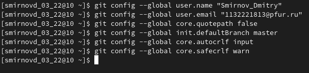{ #fig:001 width=100% }

Сгенерирую ключ для последующей идентификации пользователя на сервере репозиториев (рис 2)

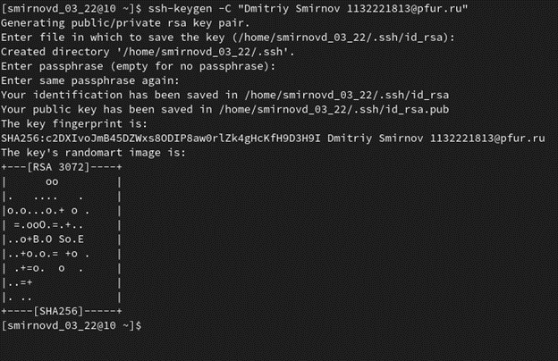{ #fig:002 width=100% }

Скопирую ssh ключ и вставлю на GitHub (рис 3, рис 4)

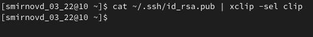{ #fig:003 width=100% }

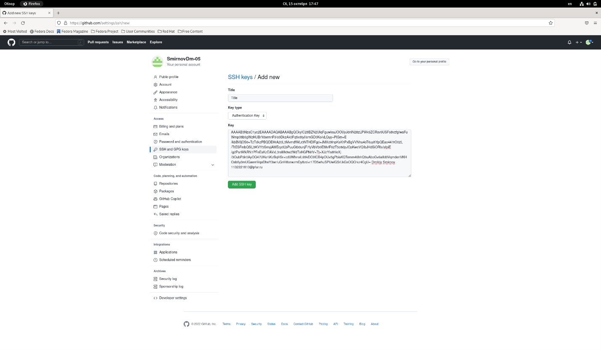{ #fig:004 width=100% }

Создам каталог для предмета «Архитектура компьютера» (рис 5)

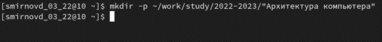{ #fig:005 width=100% }

Создам репозиторий на основе предоставленного шаблона.
Скопирую созданный репозиторий (рис 6)

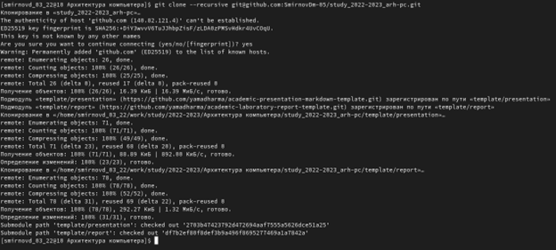{ #fig:006 width=100% }

Перейду в каталог курса. Удалю файл package.json и создам COURSE (рис 7)

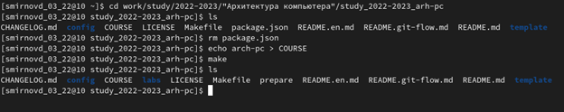{ #fig:007 width=100% }

Отправлю файлы на сервер с помощью команд:
git add . 
git commit -am 'feat(main): make course structure' 
git push

# Контрольные вопросы для самопроверки
1.	Что такое системы контроля версий (VCS) и для решения каких задач они предназначаются?
Система контроля версий — это система, регистрирующая изменения в одном или нескольких файлах с тем, чтобы в дальнейшем была возможность вернуться к определённым старым версиям этих файлов. Применяются при работе нескольких человек над одним проектом.
2.	Объясните следующие понятия VCS и их отношения: хранилище, commit, история, рабочая копия.
Хранилище, или репозитарий, — место хранения всех версий и служебной информации.
Commit - зафиксированный набор изменений, который показывает, какие файлы изменились и что именно в них изменилось.
Рабочая копия — текущее состояние файлов проекта, основанное на версии, загруженной из хранилища
3.	Что представляют собой и чем отличаются централизованные и децентрализованные VCS? Приведите примеры VCS каждого вида.
Централизованные VCS. 
Одно основное хранилище всего проекта.
Каждый пользователь копирует себе необходимые ему файлы из этого репозитория, изменяет и, затем, добавляет свои изменения обратно

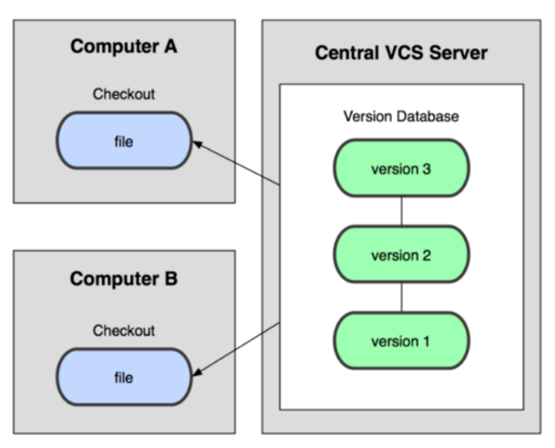{ #fig:008 width=100% }

Децентрализованные VCS.
У каждого пользователя свой вариант (возможно не один) репозитория.
Присутствует возможность добавлять и забирать изменения из любого репозитория

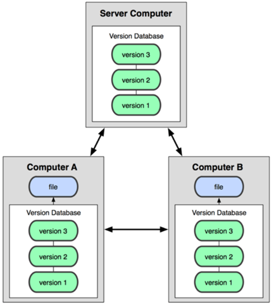{ #fig:009 width=100% }

4. 4.	Опишите действия с VCS при единоличной работе с хранилищем.

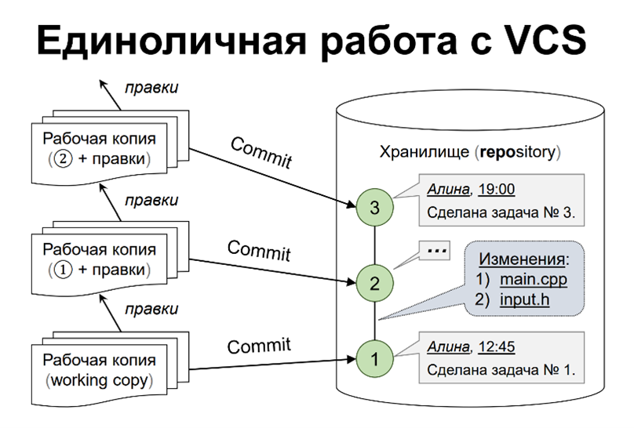{ #fig:010 width=100% }

5. 5.	Опишите порядок работы с общим хранилищем VCS.

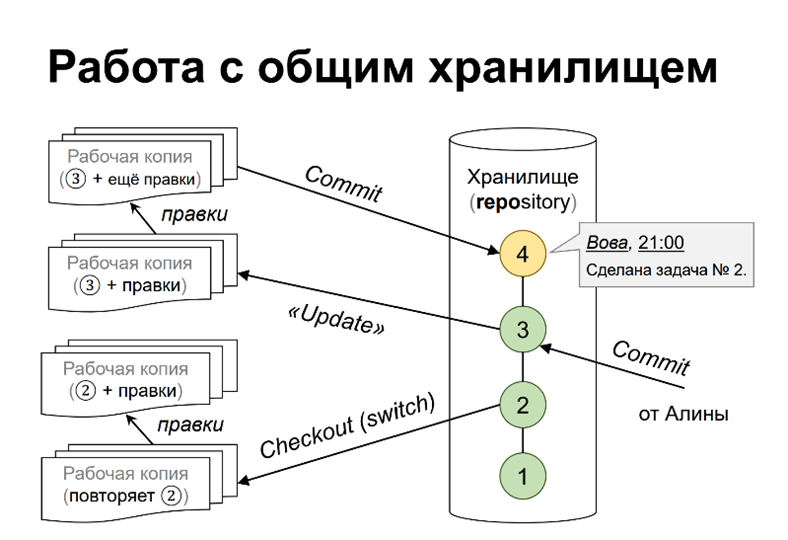{ #fig:011 width=100% }

6.	Каковы основные задачи, решаемые инструментальным средством git?
У Git две основных задачи: первая — хранить информацию о всех изменениях в вашем коде, начиная с самой первой строчки, а вторая — обеспечение удобства командной работы над кодом.
7.	Назовите и дайте краткую характеристику командам git.
git init создание основного дерева репозитория 
git pull получение обновлений (изменений) текущего дерева из центрального репозитория 
git push отправка всех произведённых изменений локального дерева в центральный репозиторий 
git status просмотр списка изменённых файлов в текущей директории 
git diff просмотр текущих изменения 
git add . добавить все изменённые и/или созданные файлы и/или каталоги 
git add имена_файлов добавить конкретные изменённые и/или созданные файлы и/или каталоги 
git rm имена_файлов удалить файл и/или каталог из индекса репозитория (при этом файл и/или каталог остаётся в локальной директории) 
git commit -am 'Описание коммита' сохранить все добавленные изменения и все изменённые файлы
git checkout -b имя_ветки создание новой ветки, базирующейся на текущей 
git checkout имя_ветки переключение на некоторую ветку (при переключении на ветку, которой ещё нет в локальном репозитории, она будет создана и связана с удалённой) 
git push origin имя_ветки отправка изменений конкретной ветки в центральный репозиторий 
git merge --no-ff имя_ветки слияние ветки с текущим деревом 
git branch -d имя_ветки удаление локальной уже слитой с основным деревом ветки 
git branch -D имя_ветки принудительное удаление локальной ветки 
git push origin :имя_ветки удаление ветки с центрального репозитория
8.	Приведите примеры использования при работе с локальным и удалённым репозиториями.
Команда git fetch связывается с удалённым репозиторием и забирает из него все изменения, которых у вас пока нет и сохраняет их локально.
Команда git pull вначале забирает изменения из указанного удалённого репозитория, а затем пытается слить их с текущей веткой.
Команда git push используется для установления связи с удалённым репозиторием, вычисления локальных изменений отсутствующих в нём, и собственно их передачи в вышеупомянутый репозиторий.

# Выводы

Я изучил идеологию и применение средств контроля версий, а также приобрел практические навыки по работе с системой git.  
