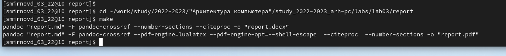

---
## Front matter
title: "Отчет по лабораторной работе №4"
author: "Смирнов Дмитрий Романович, НММбд-03-22" 

## Generic otions
lang: ru-RU
toc-title: "Содержание"

## Bibliography
bibliography: bib/cite.bib
csl: pandoc/csl/gost-r-7-0-5-2008-numeric.csl

## Pdf output format
toc: true # Table of contents
toc-depth: 2
lof: true # List of figures
lot: false # List of tables
fontsize: 12pt
linestretch: 1.5
papersize: a4
documentclass: scrreprt
## I18n polyglossia
polyglossia-lang:
  name: russian
  options:
	- spelling=modern
	- babelshorthands=true
polyglossia-otherlangs:
  name: english
## I18n babel
babel-lang: russian
babel-otherlangs: english
## Fonts
mainfont: PT Serif
romanfont: PT Serif
sansfont: PT Sans
monofont: PT Mono
mainfontoptions: Ligatures=TeX
romanfontoptions: Ligatures=TeX
sansfontoptions: Ligatures=TeX,Scale=MatchLowercase
monofontoptions: Scale=MatchLowercase,Scale=0.9
## Biblatex
biblatex: true
biblio-style: "gost-numeric"
biblatexoptions:
  - parentracker=true
  - backend=biber
  - hyperref=auto
  - language=auto
  - autolang=other*
  - citestyle=gost-numeric
## Pandoc-crossref LaTeX customization
figureTitle: "Рис."
tableTitle: "Таблица"
listingTitle: "Листинг"
lofTitle: "Список иллюстраций"
lotTitle: "Список таблиц"
lolTitle: "Листинги"
## Misc options
indent: true
header-includes:
  - \usepackage{indentfirst}
  - \usepackage{float} # keep figures where there are in the text
  - \floatplacement{figure}{H} # keep figures where there are in the text
---

# Цель работы

Целью работы является освоение процедуры оформления отчетов с помощью легковесного языка разметки Markdown.

# Выполнение лабораторной работы

Установлю TeX Live:

.png){ #fig:001 width=100% }

.png){ #fig:002 width=100% }

Установлю Pandoc и pandoc-crossref:

.png){ #fig:003 width=100% }

.png){ #fig:004 width=100% }

.png){ #fig:005 width=100% }

1. Открою терминал и перейду в каталог курса(cd ~/work/study/2022-2023/"Архитектура компьютера"/study_2022-2023_arh-pc)
2. Обновлю локальный репозиторий с помощью команды git pull
3. Перейду в каталог с шаблоном отчета по лабораторной работе № 4
cd ~/work/study/2022-2023/"Архитектура компьютера"/ study_2022-2023_arh-pc /labs/lab04/report
4. Проведу компиляцию шаблона с использованием Makefile. Для этого введу команду make
При успешной компиляции должны сгенерироваться файлы report.pdf и report.docx
5. Удалю полученные файлы с использованием Makefile. Для этого введу команду make clean
6. Открою файл report.md c помощью любого текстового редактора, например gedit
7. Заполню отчет и скомпилирую отчет с использованием Makefile. Проверю корректность полученных файлов.

# Задания для самостоятельной работы

{ #fig:006 width=100% }

# Контрольные вопросы для самопроверки

1. Что такое Markdown?
Markdown — это облегченный язык разметки с синтаксисом форматирования обычного текста.
2. Как в Markdown задается начертание шрифтов?
Чтобы задать для текста полужирное начертание необходимо заключить его в двойные звездочки
Чтобы задать для текста курсивное начертание необходимо заключить его в одинарные звездочки
Чтобы задать для текста полужирное и курсивное начертание необходимо заключить его в тройные звездочки
3. Как в Markdown оформляются списки?
Упорядоченный список можно отформатировать с помощью соответствующих цифр.
Чтобы вложить один список в другой, добавьте отступ для элементов дочернего списка.
Неупорядоченный (маркированный) список можно отформатировать с помощью звездочек или тире.
Чтобы вложить один список в другой, добавьте отступ для элементов дочернего списка.
4. Как в Markdown оформляются изображения и ссылки на них?
• в квадратных скобках указывается подпись к изображению;
• в круглых скобках указывается URL-адрес или относительный путь изображения, а также (необязательно) всплывающую подсказку, заключённую в двойные или одиночные кавычки.
• в фигурных скобках указывается идентификатор изображения (#fig:fig1) для ссылки на него по тексту и размер изображения относительно ширины страницы (width=90%)
5. Как в Markdown оформляются математические формулы и ссылки на них?
Внутритекстовые формулы делаются аналогично формулам LaTeX. Например,
формула sin^2(x) + cos^2(x) = 1 запишется как
$\sin^2 (x) + \cos^2 (x) = 1$
Выключение формулы:
sin^2(x) + cos^2(x) = 1 (4.1)
со ссылкой в тексте «Смотри формулу ({-eq. 4.1}).» записывается как
$$
\sin^2 (x) + \cos^2 (x) = 1
$$ {#eq:eq1}
Смотри формулу (`[-@eq:eq1]`).

# Выводы

Я освоил оформление отчетов с помощью языка разметки Markdown.

