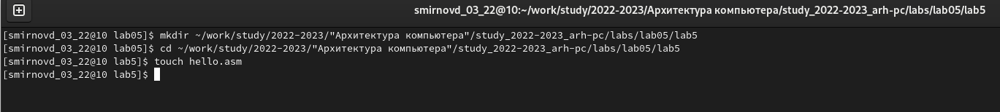
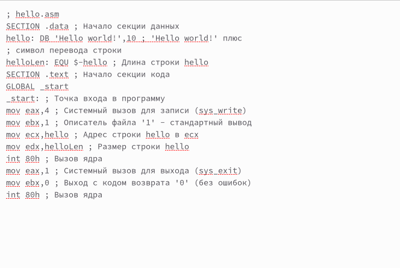
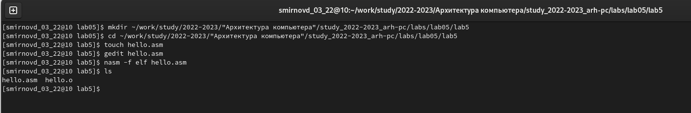
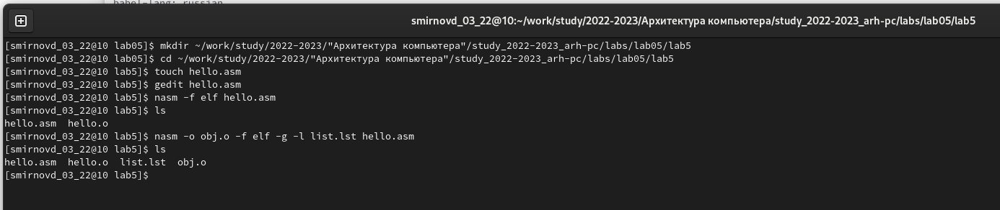
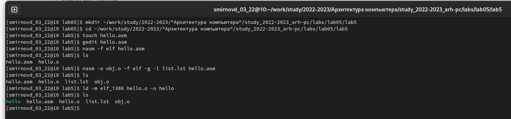
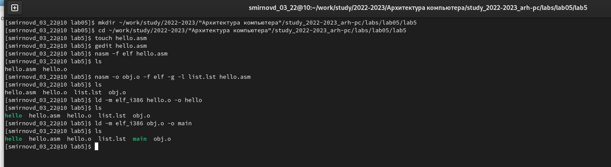
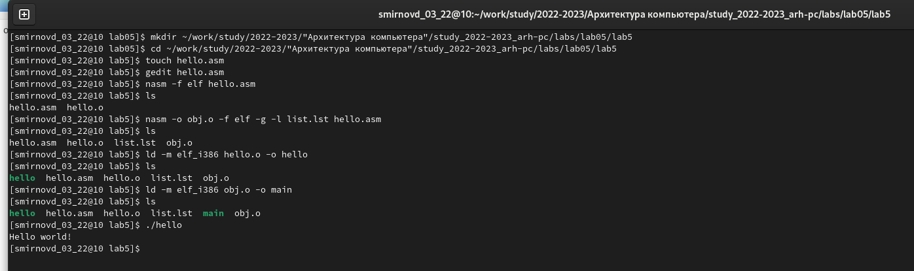
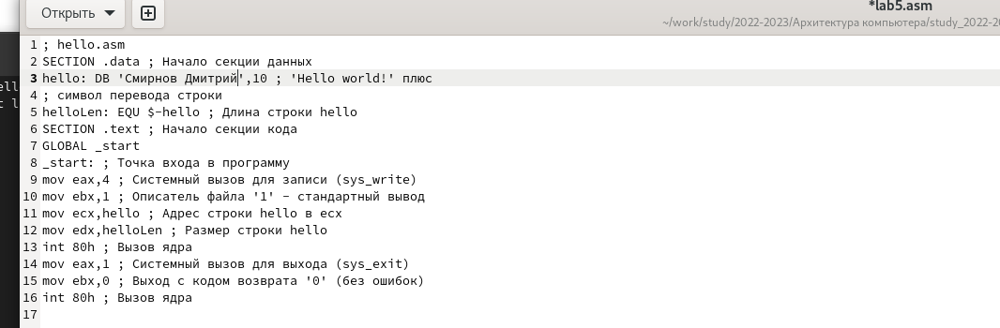
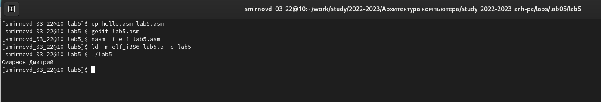

---
## Front matter
title: "Отчет по лабораторной работе №5"
author: "Смирнов Дмитрий Романович, НММбд-03-22" 

## Generic otions
lang: ru-RU
toc-title: "Содержание"

## Bibliography
bibliography: bib/cite.bib
csl: pandoc/csl/gost-r-7-0-5-2008-numeric.csl

## Pdf output format
toc: true # Table of contents
toc-depth: 2
lof: true # List of figures
lot: false # List of tables
fontsize: 12pt
linestretch: 1.5
papersize: a4
documentclass: scrreprt
## I18n polyglossia
polyglossia-lang:
  name: russian
  options:
	- spelling=modern
	- babelshorthands=true
polyglossia-otherlangs:
  name: english
## I18n babel
babel-lang: russian
babel-otherlangs: english
## Fonts
mainfont: PT Serif
romanfont: PT Serif
sansfont: PT Sans
monofont: PT Mono
mainfontoptions: Ligatures=TeX
romanfontoptions: Ligatures=TeX
sansfontoptions: Ligatures=TeX,Scale=MatchLowercase
monofontoptions: Scale=MatchLowercase,Scale=0.9
## Biblatex
biblatex: true
biblio-style: "gost-numeric"
biblatexoptions:
  - parentracker=true
  - backend=biber
  - hyperref=auto
  - language=auto
  - autolang=other*
  - citestyle=gost-numeric
## Pandoc-crossref LaTeX customization
figureTitle: "Рис."
tableTitle: "Таблица"
listingTitle: "Листинг"
lofTitle: "Список иллюстраций"
lotTitle: "Список таблиц"
lolTitle: "Листинги"
## Misc options
indent: true
header-includes:
  - \usepackage{indentfirst}
  - \usepackage{float} # keep figures where there are in the text
  - \floatplacement{figure}{H} # keep figures where there are in the text
---

# Цель работы

Целью работы является освоение процедуры компиляции и сборки программ, написанных на ассемблере NASM.

# Выполнение лабораторной работы

Создам в каталоге  cd ~/work/study/2022-2023/"Архитектура компьютера"/study_2022-2023_arh-pc/labs/lab05/lab5 файл под названием hello
{ #fig:001 width=100% }

Открою и напишу в этом текстовом файле программу выводящую "Hello world"

{ #fig:002 width=100% }

Превращу текст программы в объектный код

{ #fig:003 width=100% }

Превращу исходный код в объектный код с другим названием

{ #fig:004 width=100% }

Создам исполняемый файл

{ #fig:005 width=100% }

Создадим исполняемый файл с другим названием

{ #fig:006 width=100% }

Запущу на выполнение созданный исполняемый файл

{ #fig:007 width=100% }

# Задания для самостоятельной работы

Создадим копию файла hello.asm с названием lab5.asm
Внесу изменения в файл lab5.asm так, чтобы на вывод подавались мое имя и фамилия

{ #fig:008 width=100% }

Превращу файл lab5.asm в объектный, выполню компоновку и запущу получившийся файл

{ #fig:009 width=100% }

# Вопросы для самопроверки

1. Какие основные отличия ассемблерных программ от программ на языках высокого уровня?
Ассемблерная программа содержит только тот код, который ввел программист.
2. В чём состоит отличие инструкции от директивы на языке ассемблера?
Инструкция непосредственно преобразуется в то, что может выполнить процессор. Директива-это то, что ассемблер может интерпретировать и что-то говорит о том, как должны быть собраны инструкции.
3. Перечислите основные правила оформления программ на языке ассемблера.
1.Порядок
2.Подходы при написании комментариев
3.Проблема должна быть хорошо продумана перед тем, как она сможет быть решена
4.Оптимизация программ на языке ассемблера
4. Каковы этапы получения исполняемого файла?
Текст программы, трансляция. компоновка, запуск программы
5. Каково назначение этапа трансляции?
Трансляция — преобразование с помощью транслятора, например nasm, текста программы в машинный код, называемый объектным. На данном этапе также может быть получен листинг программы, содержащий кроме текста программы различную дополнительную информацию, созданную транслятором. Тип объектного файла — o, файла листинга — lst
6. Каково назначение этапа компоновки?
Компоновка — этап обработки объектного кода компоновщиком (ld), который принимает на вход объектные файлы и собирает по ним исполняемый файл. Исполняемый файл обычно не имеет расширения. Кроме того, можно получить файл карты загрузки программы в ОЗУ, имеющий расширение map.
7. Какие файлы могут создаваться при трансляции программы, какие из них создаются по умолчанию?
Объектные файлы - по умолчанию, а листинг - нет
8. Каковы форматы файлов для nasm и ld?
NASM - поддерживает широкий диапазон форматов объектных файлов, включая форматы Linuxa.out и ELF, NetBSD/FreeBSD, COFF, Microsoft 16-bit OBJ и Win32.
LD - elf64-x86-64 elf32-i386 elf32-iamcu elf32-x86-64 pei-i386 pe-x86-64 pei-x86-64 elf64-l1om elf64-k1om elf64-little elf64-big elf32-little elf32-big pe-bigobj-x86-64 pe-i386 elf64-bpfle elf64-bpfbe srec symbolsrec verilog tekhex binary ihex plugin
ld

# Выводы

Я изучил процедуру компиляции и процедуру сборки программ, написанных на ассемблере NASM.

