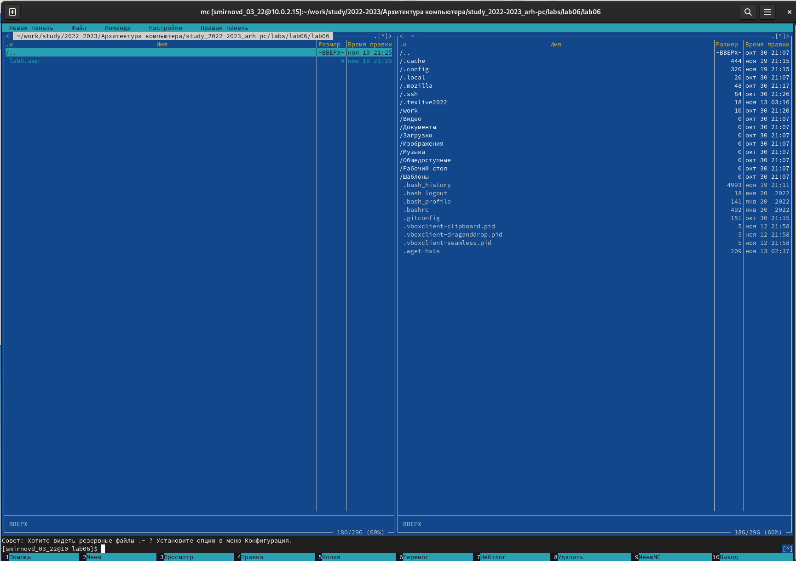
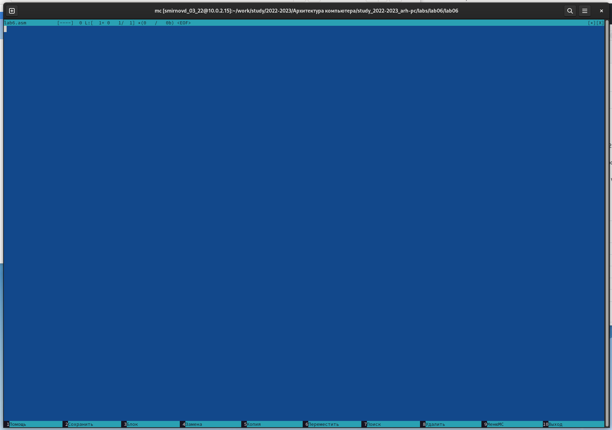
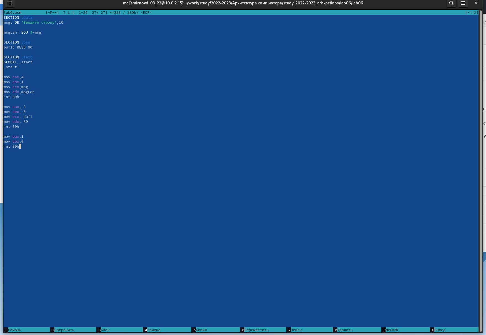
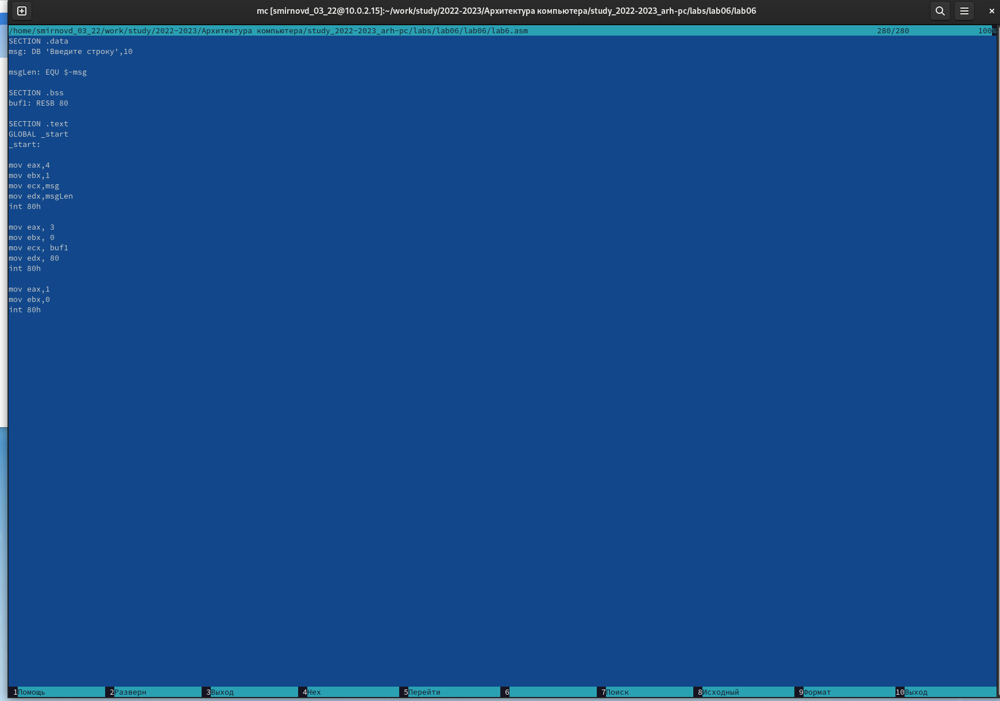
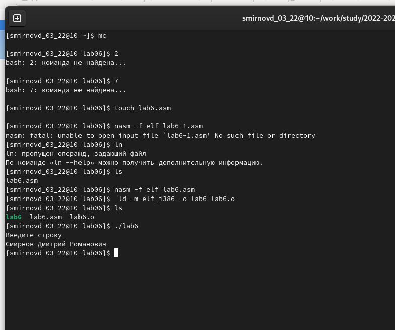
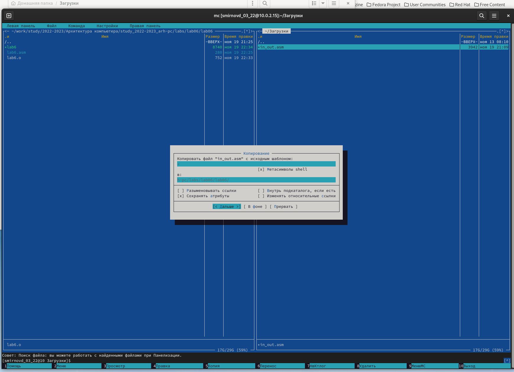
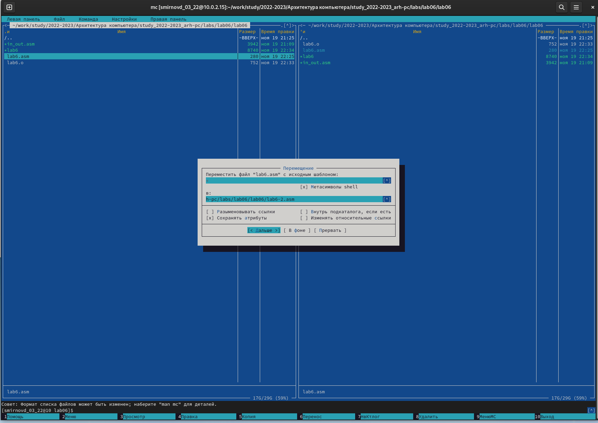
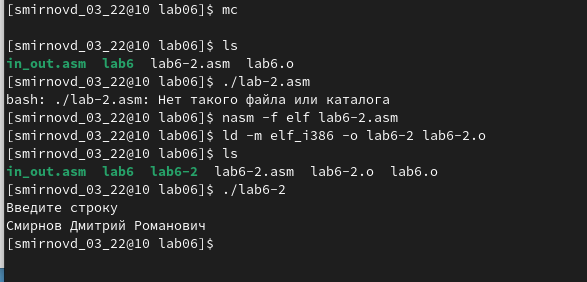
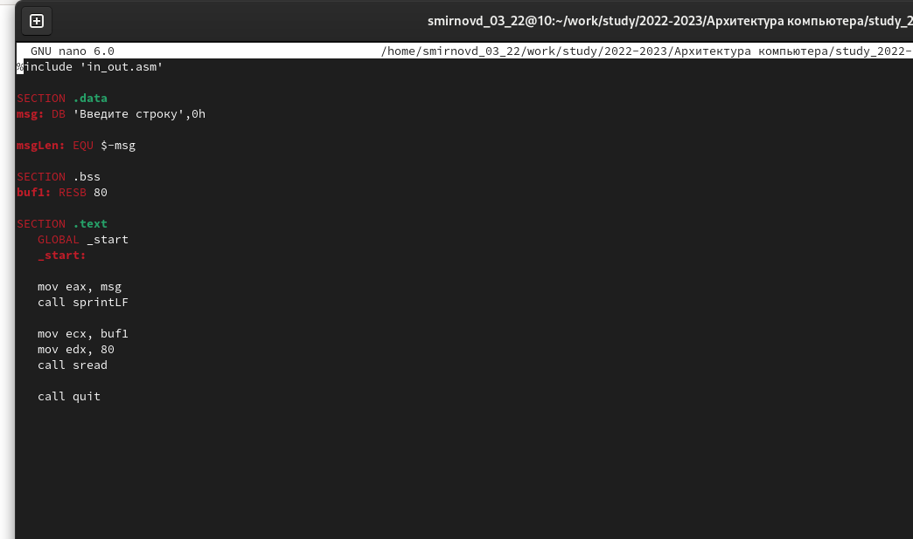
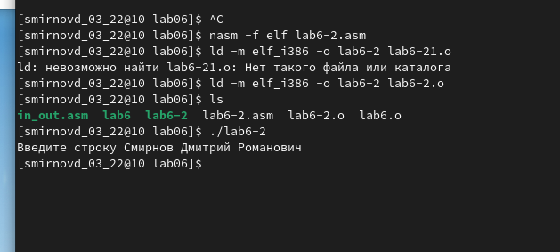

---
## Front matter
title: "Отчет по лабораторной работе №6"
author: "Смирнов Дмитрий Романович, НММбд-03-22" 

## Generic otions
lang: ru-RU
toc-title: "Содержание"

## Bibliography
bibliography: bib/cite.bib
csl: pandoc/csl/gost-r-7-0-5-2008-numeric.csl

## Pdf output format
toc: true # Table of contents
toc-depth: 2
lof: true # List of figures
lot: false # List of tables
fontsize: 12pt
linestretch: 1.5
papersize: a4
documentclass: scrreprt
## I18n polyglossia
polyglossia-lang:
  name: russian
  options:
	- spelling=modern
	- babelshorthands=true
polyglossia-otherlangs:
  name: english
## I18n babel
babel-lang: russian
babel-otherlangs: english
## Fonts
mainfont: PT Serif
romanfont: PT Serif
sansfont: PT Sans
monofont: PT Mono
mainfontoptions: Ligatures=TeX
romanfontoptions: Ligatures=TeX
sansfontoptions: Ligatures=TeX,Scale=MatchLowercase
monofontoptions: Scale=MatchLowercase,Scale=0.9
## Biblatex
biblatex: true
biblio-style: "gost-numeric"
biblatexoptions:
  - parentracker=true
  - backend=biber
  - hyperref=auto
  - language=auto
  - autolang=other*
  - citestyle=gost-numeric
## Pandoc-crossref LaTeX customization
figureTitle: "Рис."
tableTitle: "Таблица"
listingTitle: "Листинг"
lofTitle: "Список иллюстраций"
lotTitle: "Список таблиц"
lolTitle: "Листинги"
## Misc options
indent: true
header-includes:
  - \usepackage{indentfirst}
  - \usepackage{float} # keep figures where there are in the text
  - \floatplacement{figure}{H} # keep figures where there are in the text
---

# Цель работы

Приобретение практических навыков работы в Midnight Commander. Освоение инструкций языка ассемблера mov и int.

# Выполнение лабораторной работы

Открою Midnight Commander с помощью команды mc, перейду в каталог /work/study/2022-2023/Архитектура компьютера/study_2022-2023_arh-pc/labs/lab06 и создам папку lab06, а в ней файл lab6.asm

{ #fig:001 width=100% }

С помощью функциональной клавиши F4 открою файл lab6.asm для редактирования во встроенном редакторе.

{ #fig:002 width=100% }

Введу текст программы из листинга 6.1, сохраню изменения и закрою файл.

{ #fig:003 width=100% }

С помощью функциональной клавиши F3 открою файл lab6.asm для просмотра

{ #fig:004 width=100% }

Оттранслирую текст программы lab6.asm в объектный файл. Выполню компоновку объектного файла и запущу получившийся исполняемый файл. Программа выводит строку 'Введите строку:' и ожидает ввода с клавиатуры. На запрос введу свои ФИО.

{ #fig:005 width=100% }

Скачаю файл in_out.asm со страницы курса в ТУИС. И скопирую в папку /work/study/2022-2023/Архитектура компьютера/study_2022-2023_arh-pc/labs/lab06/lab06

{ #fig:006 width=100% }

С помощью функциональной клавиши F6 создам копию файла lab6.asm с именем lab6-2.asm. Выделите файл lab6.asm, нажмите клавишу F6 , введите имя файла lab6-2.asm и нажму клавишу Enter

{ #fig:007 width=100% }

Исправлю текст программы в файле lab6-2.asm с использование подпрограмм из внешнего файла in_out.asm и запущу программу

{ #fig:008 width=100% }

{ #fig:009 width=100% }

В файле lab6-2.asm заменю подпрограмму sprintLF на sprint. Создам исполняемый файл и проверю его работу

{ #fig:010 width=100% }

Разница в работе программ видна, вторая программа не переводит пользователя на новую строку. 

# Вопросы для самопроверки

1. Каково назначение mc?
Основное назначение данной программы - упростить и сделать более наглядной работу с файлами в системе Linux.
2. Какие операции с файлами можно выполнить как с помощью команд bash,
так и с помощью меню (комбинаций клавиш) mc? Приведите несколько
примеров.

3. Какова структура программы на языке ассемблера NASM?
Программа на языке ассемблера NASM, как правило, состоит из трёх секций:
секция кода программы (SECTION .text), секция инициированных (известных
во время компиляции) данных (SECTION .data) и секция неинициализированных данных (тех, под которые во время компиляции только отводится память,
а значение присваивается в ходе выполнения программы) (SECTION .bss).
4. Для описания каких данных используются секции bss и data в языке ассемблера NASM?
Эти секции используются для определения кода запуска
5. Для чего используются компоненты db, dw, dd, dq и dt языка ассемблера
NASM?
 DB (define byte) — определяет переменную размером в 1 байт;
• DW (define word) — определяет переменную размеров в 2 байта (слово);
• DD (define double word) — определяет переменную размером в 4 байта
(двойное слово);
• DQ (define quad word) — определяет переменную размером в 8 байт (учетверённое слово);
• DT (define ten bytes) — определяет переменную размером в 10 байт.
6. Какое произойдёт действие при выполнении инструкции mov eax, esi?

7. Для чего используется инструкция int 80h?
Системный вызов exit является обязательным в конце любой программы на
языке ассемблер. Для обозначения конца программы перед вызовом инструкции int 80h необходимо поместить в регистр еах значение 1, а в регистр ebx
код завершения 0.

# Выводы

Я Приобрел практические навыки работы в Midnight Commander и освоил инструкций языка ассемблера mov и int.

