---
## Front matter
title: "Отчет по лабораторной работе №7"
author: "Смирнов Дмитрий Романович"

## Generic otions
lang: ru-RU
toc-title: "Содержание"

## Bibliography
bibliography: bib/cite.bib
csl: pandoc/csl/gost-r-7-0-5-2008-numeric.csl

## Pdf output format
toc: true # Table of contents
toc-depth: 2
lof: true # List of figures
lot: false # List of tables
fontsize: 12pt
linestretch: 1.5
papersize: a4
documentclass: scrreprt
## I18n polyglossia
polyglossia-lang:
  name: russian
  options:
	- spelling=modern
	- babelshorthands=true
polyglossia-otherlangs:
  name: english
## I18n babel
babel-lang: russian
babel-otherlangs: english
## Fonts
mainfont: PT Serif
romanfont: PT Serif
sansfont: PT Sans
monofont: PT Mono
mainfontoptions: Ligatures=TeX
romanfontoptions: Ligatures=TeX
sansfontoptions: Ligatures=TeX,Scale=MatchLowercase
monofontoptions: Scale=MatchLowercase,Scale=0.9
## Biblatex
biblatex: true
biblio-style: "gost-numeric"
biblatexoptions:
  - parentracker=true
  - backend=biber
  - hyperref=auto
  - language=auto
  - autolang=other*
  - citestyle=gost-numeric
## Pandoc-crossref LaTeX customization
figureTitle: "Рис."
tableTitle: "Таблица"
listingTitle: "Листинг"
lofTitle: "Список иллюстраций"
lotTitle: "Список таблиц"
lolTitle: "Листинги"
## Misc options
indent: true
header-includes:
  - \usepackage{indentfirst}
  - \usepackage{float} # keep figures where there are in the text
  - \floatplacement{figure}{H} # keep figures where there are in the text
---

# Цель работы

Освоение арифметических инструкций языка ассемблера NASM

# Выполнение лабораторной работы

Создам каталог для программам лабораторной работы № 7, перейду в него и создам файл lab7-1.asm:
Введу в файл lab7-1.asm текст программы из листинга 7.1.

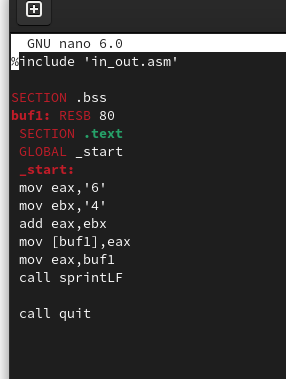{ #fig:001 width=100% }

Создам исполняемый файл и запущу его.

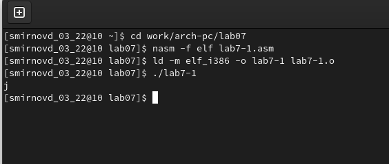{ #fig:002 width=100% }

Далее изменю текст программы и вместо символов, запишу в регистры числа

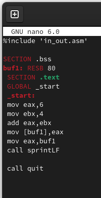{ #fig:003 width=100% }

Запущу файл. 

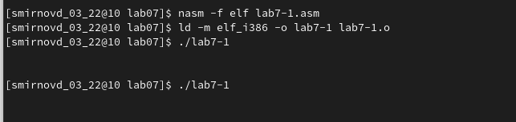{ #fig:004 width=100% }

На выводится символ с кодом 10, обозначающий спец. символ LF, \n, который не отображается при выводе на экран.
Создам файл lab7-2.asm в каталоге /work/arch-pc/lab07 и введу в него текст программы из листинга 7.2. и запущу файл.

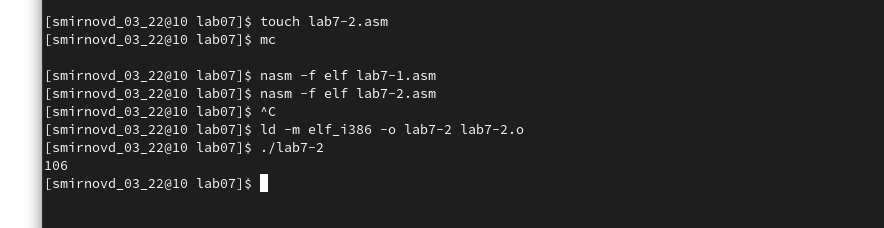{ #fig:005 width=100% }

Заменю символы на числа аналогично предыдущему примеру и запущу файл.

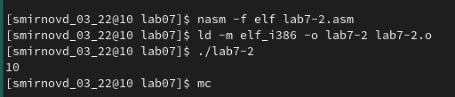{ #fig:006 width=100% }

Заменю функцию iprintLF на iprint

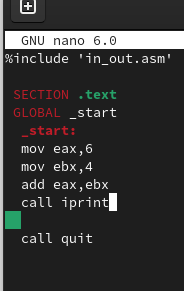{ #fig:007 width=100% }

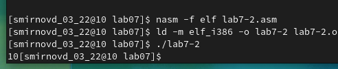{ #fig:008 width=100% }

При использовании iprintLF следующий ввод пользователь переносится на новую строку в отличии от iprint
Создам файл lab7-3.asm в каталоге /work/arch-pc/lab07:
Запишу туда текст из листинга 7.3 и запущу файл. 

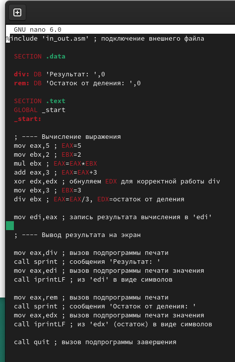{ #fig:009 width=100% }

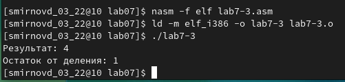{ #fig:010 width=100% }

Изменю текст программы для вычисления выражения 𝑓(𝑥) = (4 ∗ 6 + 2)/5

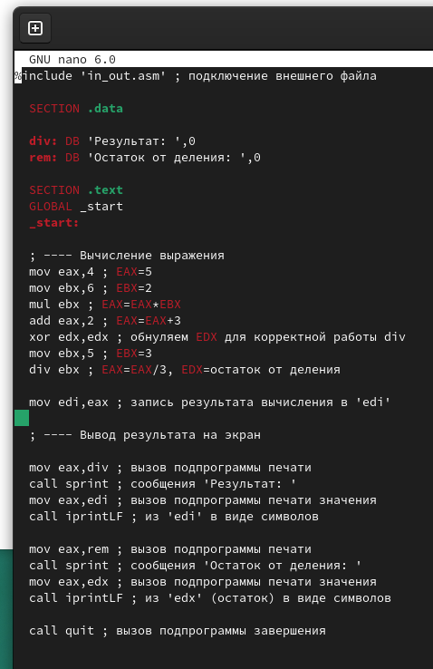{ #fig:011 width=100% }

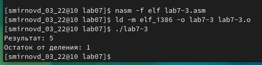{ #fig:012 width=100% }

Далее запишу программу, рассчитывающую вариант в зависимости от номера студенческого

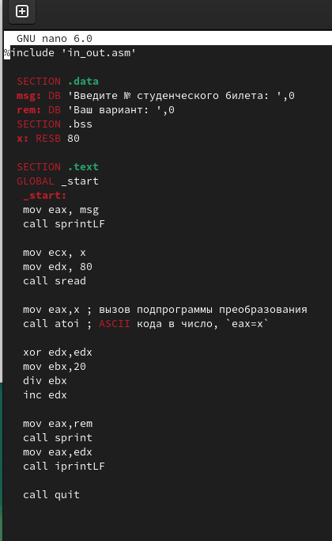{ #fig:013 width=100% }

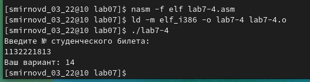{ #fig:014 width=100% }

X=1

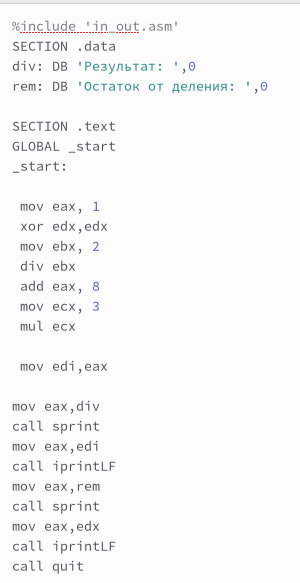{ #fig:015 width=100% }

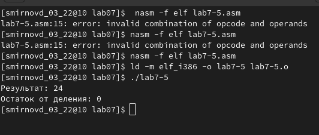{ #fig:016 width=100% }

X=4

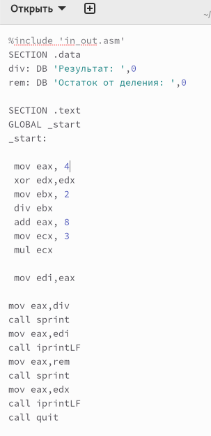{ #fig:017 width=100% }

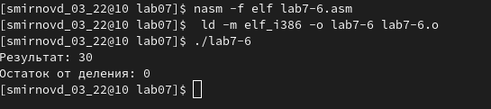{ #fig:018 width=100% }

# Вопросы для самопроверки

1.	Какие строки листинга 7.4 отвечают за вывод на экран сообщения ‘Ваш вариант:’?
mov eax,rem 
call sprint
2.	 Для чего используется следующие инструкции nasm? mov ecx, x  ; mov edx, 80 ;  call sread
mov ecx – ecx принимает значение x (строки с клавиатуры)
mov edx, 80 – edx принимает значение 80 (длина допустимого сообщения)
call sread – выводит строки с клавиатуры в ecx-адрес длины edx
3.	Для чего используется инструкция “call atoi”?
Переводит ASCII кода в число
4.	Какие строки листинга 7.4 отвечают за вычисления варианта?
xor edx,edx ; mov ebx,20 ; div ebx ; inc edx
5.	Для чего используется инструкция “inc edx”?
Увеличивает операнда на единицу
6.	Какие строки листинга 7.4 отвечают за вывод на экран результата вычислений?
mov eax,rem ; call sprint ; mov eax,edx ; call iprintLF

# Вывод

Я освоил арифметические инструкций языка ассемблер NASM
