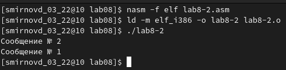

---
## Front matter
title: "Отчет по лабораторной работе №8"
author: "Смирнов Дмитрий Романович"

## Generic otions
lang: ru-RU
toc-title: "Содержание"

## Bibliography
bibliography: bib/cite.bib
csl: pandoc/csl/gost-r-7-0-5-2008-numeric.csl

## Pdf output format
toc: true # Table of contents
toc-depth: 2
lof: true # List of figures
lot: false # List of tables
fontsize: 12pt
linestretch: 1.5
papersize: a4
documentclass: scrreprt
## I18n polyglossia
polyglossia-lang:
  name: russian
  options:
	- spelling=modern
	- babelshorthands=true
polyglossia-otherlangs:
  name: english
## I18n babel
babel-lang: russian
babel-otherlangs: english
## Fonts
mainfont: PT Serif
romanfont: PT Serif
sansfont: PT Sans
monofont: PT Mono
mainfontoptions: Ligatures=TeX
romanfontoptions: Ligatures=TeX
sansfontoptions: Ligatures=TeX,Scale=MatchLowercase
monofontoptions: Scale=MatchLowercase,Scale=0.9
## Biblatex
biblatex: true
biblio-style: "gost-numeric"
biblatexoptions:
  - parentracker=true
  - backend=biber
  - hyperref=auto
  - language=auto
  - autolang=other*
  - citestyle=gost-numeric
## Pandoc-crossref LaTeX customization
figureTitle: "Рис."
tableTitle: "Таблица"
listingTitle: "Листинг"
lofTitle: "Список иллюстраций"
lotTitle: "Список таблиц"
lolTitle: "Листинги"
## Misc options
indent: true
header-includes:
  - \usepackage{indentfirst}
  - \usepackage{float} # keep figures where there are in the text
  - \floatplacement{figure}{H} # keep figures where there are in the text
---

# Цель работы

Изучение команд условного и безусловного переходов. Приобретение навыков написания программ с использованием переходов. Знакомство с назначением и структурой файла листинга.

# Выполнение лабораторной работы

Создам каталог для программ лабораторной работы № 8, перейду в него и создам файл lab8-1.asm.
{ #fig:001 width=100% }

Инструкция jmp в NASM используется для реализации безусловных переходов. Рассмотрю пример программы с использованием инструкции jmp.

{ #fig:002 width=100% }

Результат:

{ #fig:003 width=100% }

Инструкция jmp позволяет осуществлять переходы не только вперед но и назад. Изменю программу таким образом, чтобы она выводила сначала ‘Сообщение № 2’, потом ‘Сообщение № 1’ и завершала работу

{ #fig:004 width=100% }

Результат:

{ #fig:005 width=100% }

Измению текст программы добавив или изменив инструкции jmp, чтобы вывод программы был следующим: 
user@dk4n31:~$ ./lab8-1 
Сообщение № 3 
Сообщение № 2 
Сообщение № 1 
user@dk4n31:~$

{ #fig:006 width=100% }

{ #fig:007 width=100% }

Создам файл lab8-3.asm.
Введу текст программы из листинга 8.3

{ #fig:008 width=100% }

Результат:

{ #fig:009 width=100% }

Создам файл lab8-3.lst

{ #fig:010 width=100% }

Объясним содержимое трёх строк файла.

{ #fig:011 width=100% }

1)	33 - номер строки файла листинга, 0000001B - смещение машинного кода от начала текущего сегмента, 89C1 - машинный код, в который ассеблируется данная инструкция в виде шестнадцатиричной последовательности, mov ecx,eax - исходная строка программы.
2)	34 - номер строка файла листинга, 0000001D - смещение машинного кода от начала текущего сегмента, BB01000000 - машинный код, в который ассеблируется данная инструкция в виде шестнадцатиричной последовательности, mov ebx,1 - исходная строка программы.
3)	35 - номер строка файла листинга, 00000022 - смещение машинного кода от начала текущего сегмента, В804000000 - машинный код, в который ассеблируется данная инструкция в виде шестнадцатиричной последовательности, mov eax,4 - исходная строка программы. 
Если удалю один операнд в программе и выполню трансляцию с получением файла. В файле листинга также выдаст ошибку.

# Задания для самостоятельной работы:

№1

{ #fig:012 width=100% }

{ #fig:013 width=100% }

№2

{ #fig:014 width=100% }

{ #fig:015 width=100% }

# Выводы

Я изучил команды условного и безусловного переходов. Приобрел навыки написания программ с использованием переходов. Познакомился с назначением и структурой файла листинга.

