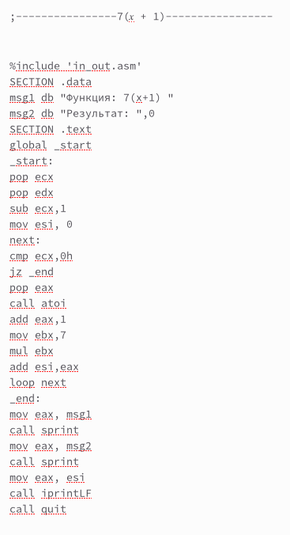

---
## Front matter
title: "Отчет по лабораторной работе №9"
author: "Смирнов Дмитрий Романович"

## Generic otions
lang: ru-RU
toc-title: "Содержание"

## Bibliography
bibliography: bib/cite.bib
csl: pandoc/csl/gost-r-7-0-5-2008-numeric.csl

## Pdf output format
toc: true # Table of contents
toc-depth: 2
lof: true # List of figures
lot: false # List of tables
fontsize: 12pt
linestretch: 1.5
papersize: a4
documentclass: scrreprt
## I18n polyglossia
polyglossia-lang:
  name: russian
  options:
	- spelling=modern
	- babelshorthands=true
polyglossia-otherlangs:
  name: english
## I18n babel
babel-lang: russian
babel-otherlangs: english
## Fonts
mainfont: PT Serif
romanfont: PT Serif
sansfont: PT Sans
monofont: PT Mono
mainfontoptions: Ligatures=TeX
romanfontoptions: Ligatures=TeX
sansfontoptions: Ligatures=TeX,Scale=MatchLowercase
monofontoptions: Scale=MatchLowercase,Scale=0.9
## Biblatex
biblatex: true
biblio-style: "gost-numeric"
biblatexoptions:
  - parentracker=true
  - backend=biber
  - hyperref=auto
  - language=auto
  - autolang=other*
  - citestyle=gost-numeric
## Pandoc-crossref LaTeX customization
figureTitle: "Рис."
tableTitle: "Таблица"
listingTitle: "Листинг"
lofTitle: "Список иллюстраций"
lotTitle: "Список таблиц"
lolTitle: "Листинги"
## Misc options
indent: true
header-includes:
  - \usepackage{indentfirst}
  - \usepackage{float} # keep figures where there are in the text
  - \floatplacement{figure}{H} # keep figures where there are in the text
---

# Цель работы

Приобретение навыков написания программ с использованием циклов и
обработкой аргументов командной строки.

# Выполнение лабораторной работы

Создам каталог для программ лабораторной работы № 9, перейду в него и создам файл lab8-1.asm.

{ #fig:001 width=100% }

Рассмотрю пример программы 9.1 предоставленной мне в лабораторной работе и выведу результат.

{ #fig:002 width=100% }

Изменю цикл с

{ #fig:003 width=100% }

на

{ #fig:004 width=100% }

В результате я получил программу, считающую только нечетный числа

{ #fig:005 width=100% }

Изменю цикл еще раз на 

{ #fig:006 width=100% }

При запуске программа выводит 6 цифр, начиная с 0.

{ #fig:007 width=100% }

Рассмотрю, следующий пример, программу 9.2 и выведу результат. 

{ #fig:008 width=100% }

Программа рассматривает пробел, ка разделитель, поэтому она вывела не «аргумент 2», а сначала «аргумент», потом «2». А вот «аргумент 3» был выведен правильно, потому что был заключен в кавычки изначально и считался одним целым. 

Рассмотрю, следующий пример, программу 9.3 и выведу результат. 

{ #fig:009 width=100% }

Программа складывает введенные мной значения. 

# Задания для самостоятельной работы:

{ #fig:010 width=100% }

{ #fig:011 width=100% }

# Вопросы для самопроверки 

1.	Опишите работу команды loop. 
Переход к обработке следующего аргумента.
2.	Как организовать цикл с помощью команд условных переходов, не прибегая к специальным командам управления циклами? 
В конце нужных операций использовать команду условного перехода, если не выполнено какое-либо условие.
3.	Дайте определение понятия «стек». 
Тип данных, представляющий собой список элементов, организованных по принципу (последним пришёл — первым вышел). 
4.	Как осуществляется порядок выборки содержащихся в стеке данных?
Особенностью стека является своеобразный порядок выборки содержащихся в нем данных: в любой момент времени в стеке доступен только верхний элемент, т.е. элемент, загруженный в стек последним. Выгрузка из стека верхнего элемента делает доступным следующий элемент.

# Выводы

Я приобрел навыки написания программ с использованием циклов и обработкой аргументов командной строки

