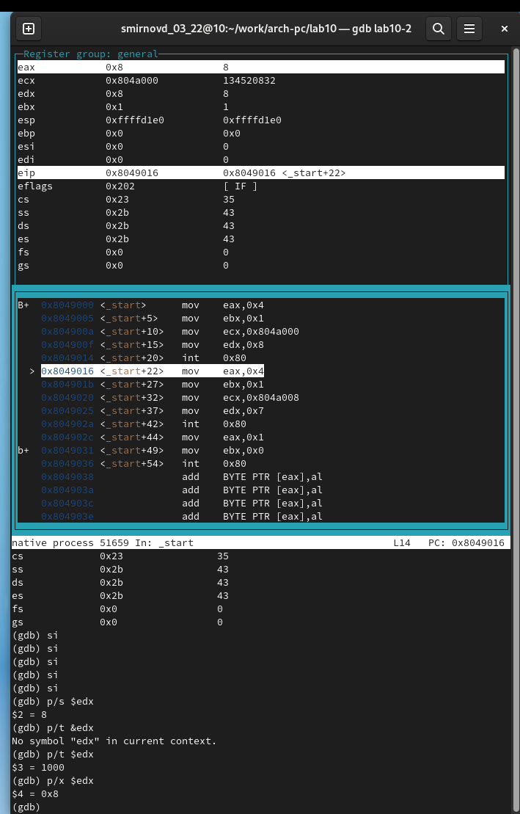

---
## Front matter
title: "Отчет по лабораторной работе №10"
author: "Смирнов Дмитрий Романович"

## Generic otions
lang: ru-RU
toc-title: "Содержание"

## Bibliography
bibliography: bib/cite.bib
csl: pandoc/csl/gost-r-7-0-5-2008-numeric.csl

## Pdf output format
toc: true # Table of contents
toc-depth: 2
lof: true # List of figures
lot: true # List of tables
fontsize: 12pt
linestretch: 1.5
papersize: a4
documentclass: scrreprt
## I18n polyglossia
polyglossia-lang:
  name: russian
  options:
	- spelling=modern
	- babelshorthands=true
polyglossia-otherlangs:
  name: english
## I18n babel
babel-lang: russian
babel-otherlangs: english
## Fonts
mainfont: PT Serif
romanfont: PT Serif
sansfont: PT Sans
monofont: PT Mono
mainfontoptions: Ligatures=TeX
romanfontoptions: Ligatures=TeX
sansfontoptions: Ligatures=TeX,Scale=MatchLowercase
monofontoptions: Scale=MatchLowercase,Scale=0.9
## Biblatex
biblatex: true
biblio-style: "gost-numeric"
biblatexoptions:
  - parentracker=true
  - backend=biber
  - hyperref=auto
  - language=auto
  - autolang=other*
  - citestyle=gost-numeric
## Pandoc-crossref LaTeX customization
figureTitle: "Рис."
tableTitle: "Таблица"
listingTitle: "Листинг"
lofTitle: "Список иллюстраций"
lotTitle: "Список таблиц"
lolTitle: "Листинги"
## Misc options
indent: true
header-includes:
  - \usepackage{indentfirst}
  - \usepackage{float} # keep figures where there are in the text
  - \floatplacement{figure}{H} # keep figures where there are in the text
---

# Цель работы

Приобретение навыков написания программ с использованием подпрограмм. Знакомство с методами отладки при помощи GDB и его основными возможностями. 

# Выполнение лабораторной работы

Создам каталог для выполнения лабораторной работы № 10 и перейду в него и о и создам файл lab10-1.asm. Запишу программу из листинга 10.1

{ #fig:001 width=100% }

{ #fig:002 width=100% }

Изменю код и получу результат

{ #fig:003 width=100% }

{ #fig:004 width=100% }

Создам файл lab10-2.asm с текстом программы из Листинга 10.2. 
Получу исполняемый файл. Для работы с GDB в исполняемый файл добавлю отладочную информацию.
Загружу исполняемый файл в отладчик gdb
Для более подробного анализа программы установлю брейкпоинт на метку _start
Посмотрю дисассимилированный код программы с помощью команды disassemble начиная с метки _start
Переключитесь на отображение команд с Intel’овским синтаксисом

{ #fig:005 width=100% }

{ #fig:006 width=100% }

{ #fig:007 width=100% }

Включите режим псевдографики для более удобного анализа программы
Установлю еще одну точку останова по адресу инструкции.
Посмотрите информацию о всех установленных точках останова

{ #fig:008 width=100% }

Посмотрите значение переменной msg1 по имени
Изменю первый символ переменной msg1
Заменю любой символ во второй переменной msg2.

{ #fig:009 width=100% }

Выведу в различных форматах (в шестнадцатеричном формате, в двоичном формате и в символьном виде) значение регистра edx.

{ #fig:010 width=100% }

С помощью команды set изменю значение регистра ebx

{ #fig:011 width=100% }

Скопирую файл lab9-2.asm, созданный при выполнении лабораторной работы №9
Создам исполняемый файл.
Для начала установлю точку останова перед первой инструкцией в программе и запущу ее.

{ #fig:012 width=100% }

# Задания для самостоятельной работы:

№1

{ #fig:013 width=100% }

{ #fig:014 width=100% }

№2

{ #fig:015 width=100% }

{ #fig:016 width=100% }

{ #fig:017 width=100% }

# Выводы

Я приобрел навык написания программ с использованием подпрограмм. Я познакомился с методами отладки при помощи GDB и его основными возможностями

