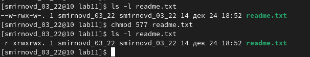

---
## Front matter
title: "Отчет по лабораторной работе №11"
author: "Смирнов Дмитрий Романович"

## Generic otions
lang: ru-RU
toc-title: "Содержание"

## Bibliography
bibliography: bib/cite.bib
csl: pandoc/csl/gost-r-7-0-5-2008-numeric.csl

## Pdf output format
toc: true # Table of contents
toc-depth: 2
lof: true # List of figures
lot: false # List of tables
fontsize: 12pt
linestretch: 1.5
papersize: a4
documentclass: scrreprt
## I18n polyglossia
polyglossia-lang:
  name: russian
  options:
	- spelling=modern
	- babelshorthands=true
polyglossia-otherlangs:
  name: english
## I18n babel
babel-lang: russian
babel-otherlangs: english
## Fonts
mainfont: PT Serif
romanfont: PT Serif
sansfont: PT Sans
monofont: PT Mono
mainfontoptions: Ligatures=TeX
romanfontoptions: Ligatures=TeX
sansfontoptions: Ligatures=TeX,Scale=MatchLowercase
monofontoptions: Scale=MatchLowercase,Scale=0.9
## Biblatex
biblatex: true
biblio-style: "gost-numeric"
biblatexoptions:
  - parentracker=true
  - backend=biber
  - hyperref=auto
  - language=auto
  - autolang=other*
  - citestyle=gost-numeric
## Pandoc-crossref LaTeX customization
figureTitle: "Рис."
tableTitle: "Таблица"
listingTitle: "Листинг"
lofTitle: "Список иллюстраций"
lotTitle: "Список таблиц"
lolTitle: "Листинги"
## Misc options
indent: true
header-includes:
  - \usepackage{indentfirst}
  - \usepackage{float} # keep figures where there are in the text
  - \floatplacement{figure}{H} # keep figures where there are in the text
---

# Цель работы

Приобрести навыки написания программ для работы с файлами.

# Выполнение лабораторной работы

Создаём каталог для программ лабораторной работы №11, переходим в него и создаём файл.

{ #fig:001 width=100% }

Открываем файл и вводим текст программы. Создаём исполняемый файл и проверяем его работу.

{ #fig:002 width=100% }

{ #fig:003 width=100% }

С помощью команды ‘chmod’ изменяем права доступа к исполняемому файлу lab11-1.

{ #fig:004 width=100% }

Теперь с помощью той же комнады попытаемся изменить права доступа к файлу lab11-2.asm. с исходным текстом программы.

{ #fig:005 width=100% }

Предоставим права доступа к файлу ‘readme.txt’ в соответствии с вариантом 14. В двоичной системе 110 111 110.

{ #fig:006 width=100% }

В символьном виде имеем r-x rwx rwx. 

{ #fig:007 width=100% }

#Задания для самостоятельной работы:

Напшием программу, которая работает по следующему алгоритму 
• Вывод приглашения “Как Вас зовут?” 
• Ввести с клавиатуры свои фамилию и имя 
• Создать файл с именем name.txt 
• Записать в файл сообщение “Меня зовут” 
• Дописать в файл строку введенную с клавиатуры 
• Закрыть файл 
Для этого создаём файл lab11-2.asm для текста прогарммы и файл name.txt

{ #fig:008 width=100% }

Открываем файл и пишем текст программы.

{ #fig:009 width=100% }

{ #fig:010 width=100% }

Результат

{ #fig:011 width=100% }

# Выводы

В ходе выполнения данной лабараторной работы я приобрел навыки написания программ для работы с файлами.

